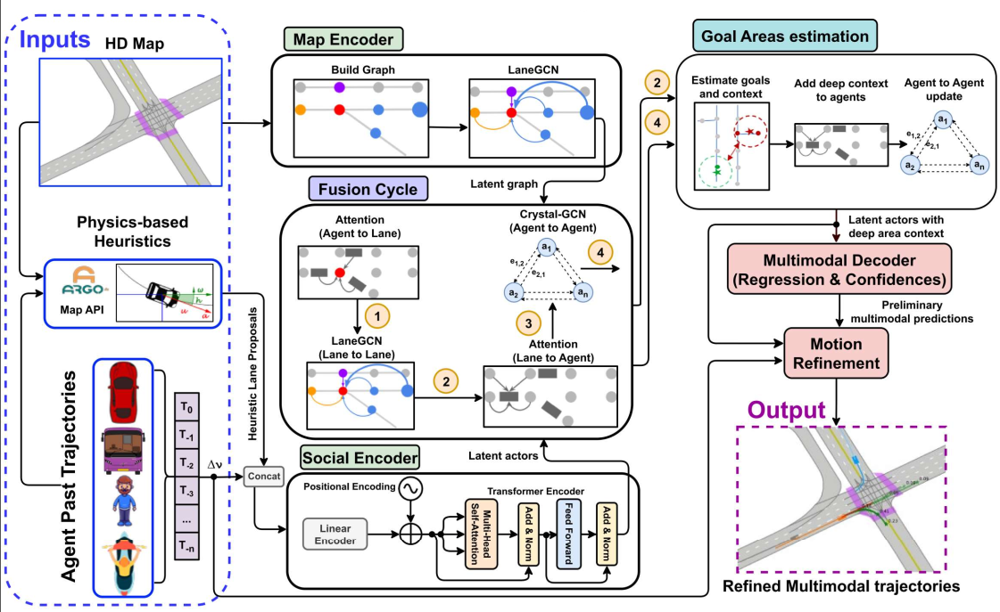

# Improving Multi-Agent Motion Prediction with Heuristic Goals and Motion Refinement

<!-- TODO: arxiv of AI City challenge paper -->
<!-- []([https://arxiv.org/abs/2205.13071](https://openaccess.thecvf.com/content/CVPR2023W/AICity/html/Conde_Improving_Multi-Agent_Motion_Prediction_With_Heuristic_Goals_and_Motion_Refinement_CVPRW_2023_paper.html)) -->
<!--  -->

[Carlos Gómez-Huélamo](https://scholar.google.com/citations?view_op=list_works&hl=es&hl=es&user=OWwoG6EAAAAJ), 
[Marcos V. Conde](https://scholar.google.com/citations?user=NtB1kjYAAAAJ&hl=en)

[RobeSafe group, University of Alcalá, UAH](http://robesafe.es/index.php/en/research-staff/staff)
[Computer Vision Lab, CAIDAS, University of Würzburg](https://www.informatik.uni-wuerzburg.de/computervision/home/)

------------------

**News 🚀🚀**

- [05/2023] Work on integrating the model (without map information) with the decision-making layers in SMARTS/SUMO
- [04/2023] Work on accepted on the AI City Challenge (CVPR 2023) :)

------------------

This is the official repository and PyTorch implementations of different works presented at:
- [AI City Challenge](https://www.aicitychallenge.org/) Workshop at CVPR 2023 (Vancouver, Canada)

Our papers:
- [Improving Multi-Agent Motion Prediction With Heuristic Goals and Motion Refinement](https://openaccess.thecvf.com/content/CVPR2023W/AICity/html/Conde_Improving_Multi-Agent_Motion_Prediction_With_Heuristic_Goals_and_Motion_Refinement_CVPRW_2023_paper.html) at CVPR 2023 workshop

>Motion Prediction (MP) of multiple surrounding agents in physical environments, and accurate trajectory forecasting, is a crucial task for Autonomous Driving Stacks (ADS) and robots. Current methods for MP use end-to-end pipelines, where the input data is usually a HD map and the past trajectories of the most relevant agents; leveraging this information is a must to obtain optimal performance. In that sense, a reliable Autonomous Driving (AD) system must produce fast and accurate predictions to ensure traffic safety. In this work, we tackle Multi-Agent Motion Prediction using an end-to-end pipeline that combines Deep Learning (DL) and heuristic scene understanding. Our model uses as input the map of the scene, the past trajectories of the agents, and additional information about the scene geometry and agents e.g., type of agent, lane distribution. We design our model using powerful attention mechanisms with GNNs to enhance agents interactions, heuristic proposals as preliminary plausible information and a motion refinement module to further improve temporal consistency. We achieve SOTA results on the Argoverse 2 Motion Forecasting Benchmark reducing in millions of parameters previous methods such as GANet, and improving over LaneGCN. Our code is available at https://github.com/Cram3r95/argo2goalmp. 

## Model



<!--
## MFTF Model 

-->
Overview
=================
  * [Set up Virtual Environment](#set_up_virtual_environment)
  * [Download Argovers2 Dataset](#download_argovers2_dataset)
  * [Data Cleaning](#data_cleaning)
  * [Raw Feature Extracting](#Extract_Raw_Features_from_arg2_Dataset)
  * [Training](#training)
  * [Testing](#testing)
  * [Checkpoints](#Checkpoints)

## Set up Virtual Environment

From:

```docker pull nvcr.io/nvidia/pytorch:22.04-py3```

```sh
# Avoid using conda. Your life will be better.
# OBS: Install pip, if not installed previously .
sudo apt install python3-pip

# Export the environment variables to bashrc
echo 'cd $HOME' >> ~/.bashrc 
echo 'alias python=/usr/bin/python3.8' >> ~/.bashrc 
echo 'alias pip=/usr/bin/pip' >> ~/.bashrc 

# Install the required dependencies
pip install \
    prodict \
    torch \
    pyyaml \
    torchvision \
    tensorboard \
    glob2 \
    matplotlib \
    sklearn \
    gitpython \
    thop \
    fvcore \
    torchstat \
    torchsummary \
    ipykernel \
    sns \
    pytorch-lightning \
    pyarrow \
    fastparquet \ 
    parmap
```

After all (not before!), you can install torch-geometric, in my case assuming torch 1.13 and CUDA 11.6:

```pip install torch-scatter torch-sparse torch-cluster torch-spline-conv torch-geometric -f https://data.pyg.org/whl/torch-1.13.0+cu116.html```

And check the torch-geometric dependencies:

```python -c "import torch-geometric"```

Install Argoverse 1 in /home/your_user following these instructions:

https://github.com/argoverse/argoverse-api/blob/master/README.md

1. Clone Argoverse 1 repository: \
    1.1. git clone https://github.com/argoai/argoverse-api.git

2. Download, extract and move Argoverse 1 map files: \
    2.1. wget https://s3.amazonaws.com/argoai-argoverse/hd_maps.tar.gz \
    2.2. tar -xvkf hd_maps.tar.gz \
    2.3. rm -rf hd_maps.tar.gz && mv map_files $HOME/argoverse-api

3. Install Argoverse 1 package:\
    3.1. ```pip install -e $HOME/argoverse-api``` (execute this command several times if you find dependencies issues between
    Argoverse 2 api and Argoverse 1 api)

4. Check both Argoverse 1 and 2 are installed: \
    4.1. python -c "import argoverse, av2"

After installing Argoverse 1, you may have a problem with numpy:

pip install numpy==1.23.0

pip install --upgrade tensorboard (former versions have max pin limit set to 4)

## Download Argovers2 Dataset

Run the following script to download the Argovers Motion Forecasting Version2. [Dataset Link](https://github.com/argoai/av2-api/blob/main/src/av2/datasets/motion_forecasting/README.md)

```sh
bash scripts/download_dataset.sh
```
## Data Cleaning
According to the paper of [Argoverse 2](https://datasets-benchmarks-proceedings.neurips.cc/paper/2021/file/4734ba6f3de83d861c3176a6273cac6d-Paper-round2.pdf), the focal agent should always be observed over the full 11 seconds, which then corresponds to 110 observations:

*Within each scenario, we mark a single track as the **focal agent**. Focal tracks are guaranteed to be fully observed throughout the duration of the scenario and have been specifically selected to maximize interesting interactions with map features and other nearby actors (see Section 3.3.2)*

However, this is not the case for some scenarios (~3% of the scenarios).
One example: Scenario '0215552f-6951-47e5-8cf6-3d1351d28957' of the validation set has a trajectory with only 104 observations.
To clean these scenarios from the dataset run the following script. This code cleans the train and val directories. 
```sh
python3 scripts/clean_data.py
```
## Raw Feature Extracting
To preprocess and extract the posotion_x and position_y displacements run the following command. This code creates three .pkl files for train, val, and, test.  
```sh
python3 preprocess.py
```  
## Training

<!-->
**1- CRAT-Pred Model (LSTM + Graph + Multi-Head Self-Attention + Residual):** Vehicle Trajectory Prediction with Crystal Graph Convolutional Neural Networks and Multi-Head Self-Attention. [Paper](https://arxiv.org/abs/2202.04488) 
-->

**1-TGR Model (Transformer Encoder + Graph + Residual):** Replacing the LSTM + Multi-Head Self-Attention sub-networks with a single Transformer Encoder:

```sh
python3 train_TGR.py --use_preprocessed=True # for using the offline preprocessing step please use True for --use_preprocessed  
```

To check the metrics during training:

1. If using the default Lightning logger (Tensorboard) or specifically Tensorboard:
```cd ~/CGHFormer/dataset/argoverse2/save_models && python -m tensorboard.main --logdir . --port=6100```

2. If using Wandb (first you must create an account and have installed wandb):
```pip install wandb```
Open your Navigator -> Sign in your account -> Monitorize the experiments

OBS: 

## Testing
To test model on validation data on models:

1- Please comment line 217 in the following file:
https://github.com/argoai/argoverse-api/blob/master/argoverse/evaluation/eval_forecasting.py 
First, find the path of this file in your system after installing the Argoverse api_1 package. (pip3 install git+https://github.com/argoai/argoverse-api.git)
Then comment the line 217 which uses the Map information to compute the DAC parameter. 

```sh
python3 test_TGR.py --ckpt_path=/path/to/checkpoints --split=val 
# Also you can use this file to generate prediction on test dataset. simply use --split-test
```
## Checkpoints 
```sh
#Regenerate the evaluation parameters using pre-trained checkpoints: TGR.ckpt and Crat_Pred.ckpt
python3 test_TGR.py --ckpt_path=checkpoints/TGR.ckpt --split=val --use_preprocessed=True  
```

Base Code: The base code of [repository](https://github.com/schmidt-ju/crat-pred) has been used.
